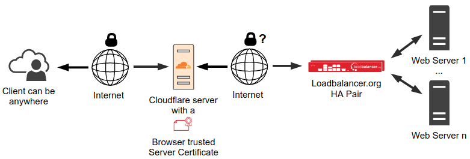
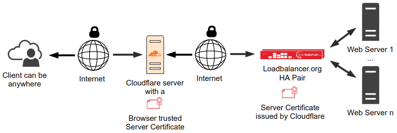

## DNS Only

## Proxied

# Process

1. Sign-up / Log into Cloudflare
2. On Cloudflare, locate the Websites tab on left, click `Add a site`
3. Enter your domain name
4. Get the nameservers in the DNS settings
5. Log into GoDaddy and update the nameservers with the Cloudflare NS records
6. In Cloudflare, change all your records' Proxy status to DNS only
7. Wait for all DNS caches to flush and NS update
8. In Cloudflare, click your website, then choose SSL/TLS of the left
9. On Overview, choose `Full`
10. Go back to the DNS page and turn the CNAME records' Proxy status back to `Proxied`. **DO NOT** Proxy the IP address otherwise you'll break VPN
11. Click SSL/TLS again and click Edge Certificates
12. Enable Always Use HTPS and HSTS.
13. Change Minimum TLS version to 1.2
14. Go to Origin Server and Create Certificate
15. Copy and paste the cert and key into a notepad for safe keeping
16. Go into pfSense's Cert Manager and import the cert
17. Go to HAProxy and change the frontend's cert to the new Origin Server Cert
18. Go back to Cloudflare SSL/TLS Overview and select `Full (strict)`
19. Go into the Origin Server settings and enable `Authenticated Origin Pulls`

### Sources

- [Getting pfsense/HAProxy to work behind Cloudflare](https://discourse.haproxy.org/t/getting-pfsense-haproxy-to-work-behind-cloudflare/4749/9)
- [Setup & Configure HAProxy Container with Cloudflare Origins](https://ciphermenial.github.io/posts/configure-haproxy-container/)
- [Looking for HAProxy behind Cloudflare tutorial / example](https://discourse.haproxy.org/t/looking-for-haproxy-behind-cloudflare-tutorial-example/8508/6)
- [How to add Cloudflare in front of HAProxy](https://www.loadbalancer.org/blog/how-to-add-cloudflare-in-front-of-a-load-balancer/)

