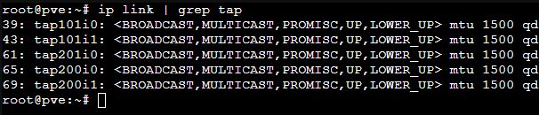

# Installing AC-Hunter on Proxmox


## RTFM First

- [:octicons-link-external-16: Preinstall Guide](https://www.activecountermeasures.com/wp-content/uploads/2023/02/AC-Hunter-Pre-Install-Guide-v6_3_0-CE.pdf) :fontawesome-solid-file-pdf:
- [:octicons-link-external-16: Install Guide](https://www.activecountermeasures.com/wp-content/uploads/2023/06/AC-Hunter-Install-Guide-v6_3_0-CE_v2.pdf) :fontawesome-solid-file-pdf:

## The Procedure

!!! note
    This process will install Zeek, BeaKer, and AC-Hunter. I am running this on my home network to experiment with Zeek and AC-Hunter. See the link down below about the warning about capturing packets in a VM.

??? bug "DO NOT USE LXC CONTAINERS"
    If you use the `ubuntu-20.04-standard_20.04-1_amd64.tar.gz` LXC CT Template, AC-Hunter will fail to start. 

1. Install Proxmox (this guide does not cover how to do that)
2. Navigate to Proxmox's local -> ISO Images and download Ubuntu 20.04 to storage. You can find it [:octicons-link-external-16: here](https://releases.ubuntu.com/20.04/).
3. Install OpenV Switch in Proxmox
   ```
   root@pve:~#  apt install -y openvswitch-switch
   ```
4. Create an OVS vmbr and port  
   a. In the Proxmox Network, create a new OVS Bridge and give it a vmbr name and ensure `Autostart` is selected  
   b. In the Bridge ports section, select the physical interface ie. `eno4`
5. In a Proxmox shell (replace the # with your vmbr name)
   ```
   root@pve:~# ovs-vsctl clear bridge vmbr# mirrors
   ```
6. Create a new VM using the Ubuntu ISO with
   ```
   VM ID: <as applicable>
   Name: <zeek or whatever seems appropriate>
   Disk: 500GB
   CPU: 4 Cores
   RAM: 32GB (32768MB)
   Network: <appropriate Bridge> (this will be management)
   ```
7. Open the new VM settings, create a new *Network Device*, and attach the vmbr to the *second* network interface then UNCHECK firewall
8. Create a second VM using the Ubuntu ISO with
   ```
   VM ID: <as applicable>
   Name: <ACHunter or whatever seems appropriate>
   Disk: 500GB
   CPU: 8 (2 sockets, 4 Cores)
   RAM: 64GB (65536MB)
   Network: <appropriate Bridge> (this will be management)
   ```
9. Start the AC-Hunter and Zeek VMs
10. Update both systems
11. This guide does not cover how to set up SSH, but you need to configure SSH for the two VMs to talk to each other. You will need to use `ssh-keygen` to make new SSH keys and `ssh-copy-id` to copy the keys to each of the servers. Ensure you can SSH into each other. **NOTE** I also suggest modifying your `/etc/hosts` file to include the IP address and hostname of the servers. Similar to the one below:
    ```
    192.168.1.100 zeek zeek.home.network
    192.168.1.101 achunter achunter.home.network
    ```
12. In the Proxmox shell:  
   In the commands below, the `ip link | grep tap` command will show all the interfaces, you're looking for a `tap` with the VM's ID in the interface. For example, if you have the Zeek container as VM 200, you'd look for `tap200i1`. The `tap200i0` is the first interface for the management interface. You will replace that in the second command. You will also replace the # with the vmbr you created earlier. 
   ```
   root@pve:~# ip link | grep tap
   root@pve:~# ovs-vsctl --id=@p get port tap<VMID>i1 -- --id=@m create mirror name=span1 select-all=true output-port=@p -- set bridge vmbr# mirrors=@m
   ```
13. [:octicons-link-external-16: Download](https://www.activecountermeasures.com/ac-hunter-community-edition/linux-download/) the AC-Hunter *tar* file into the AC-Hunter VM
14. Run the install script based on the *Install Guide* (see, told you to RTFM.)
    ```
    tar xvf *.tar
    cd achunter
    ./install_acm.sh zeek user@zeek achunter user@achunter beaker user@achunter
    ```

### Troubleshooting

While installing, if you receive an error stating something along the lines of `TypeError: kwargs_from_env() got an unexpected keyword argument 'ssl_version'` you can reference a dude's workaround in [:octicons-link-external-16: Discord](https://discord.com/channels/690293821866508430/1078339857937604638/1187083966239477900
).

> I ran into an error when installing AC Hunter CE on a fresh Ubuntu 22.0.4.3 LTS system with Python 3.10.12, Docker version 24.07, and docker-compose version 1.29.2. The error occured at line 362 of install_ac_hunter.sh: ```local mongo_datasets=`./hunt run --rm db_client mongo_cmd.sh "db.getMongo().getDBNames()"```. The error was thrown by docker-compose, which was being called from the hunt bash script, so this issue could also be seen outside of the installation process. 

> The last part of the error is:
  ```
  File "/usr/local/lib/python3.10/dist-packages/compose/cli/docker_client.py", line 124, in docker_client
    kwargs = kwargs_from_env(environment=environment, ssl_version=tls_version)
TypeError: kwargs_from_env() got an unexpected keyword argument 'ssl_version'
   ```

### Workaround #1

~~Use older version of Docker / docker-compose.~~

### Workaround #2

Need to edit 3 lines in `/usr/local/lib/python3.10/dist-packages/compose/cli/docker_client.py` (make a backup first).  Delete line 112 with `ssl_version=tls_version`. Also, remove the ending comma from line 111. Line 123 (line 124 in the unedited file), remove `, ssl_version=tls_version`. 

The updated file should look like:

Lines 109 - 111:
```
        return TLSConfig(
            client_cert=client_cert, verify=verify, ca_cert=ca_cert,
            assert_hostname=False if skip_hostname_check else None
        )
```

        
Line 123:
```
        kwargs = kwargs_from_env(environment=environment)
```

After this change, the installation of AC Hunter and Zeek will complete without errors. AC-Hunter CE is up and running.

## User Guides

- [:octicons-link-external-16: AC-Hunter CTF User Guide](https://www.activecountermeasures.com/wp-content/uploads/2022/02/AC-Hunter-CTF-User-Guide_2022.pdf) :fontawesome-solid-file-pdf:
- [:octicons-link-external-16: AC-Hunter User Guide](https://www.activecountermeasures.com/wp-content/uploads/2023/02/AC-Hunter-User-Guide-v6_3_0-CE.pdf) :fontawesome-solid-file-pdf:

## Resources/Sources

- [:octicons-link-external-16: HoldMyBeer Security: Install/Setup Zeek + PF_Ring on Ubuntu 18.04 on Proxmox 5.3 + OpenVSwitch](https://holdmybeersecurity.com/2019/04/03/part-1-install-setup-zeek-pf_ring-on-ubuntu-18-04-on-proxmox-5-3-openvswitch/) :fontawesome-solid-blog:
- [:octicons-link-external-16: Active Countermeasures: Is It OK to Capture Packets in a Virtual Machine?](https://www.activecountermeasures.com/is-it-ok-to-capture-packets-in-a-virtual-machine/) :fontawesome-solid-blog:
- [:octicons-link-external-16: Installing Security Onion on Proxmox video](https://www.youtube.com/watch?v=BA6wuWM9acY) :simple-youtube:
- [:octicons-link-external-16: Security Onion and Proxmox FYI on promisc setup](https://github.com/Security-Onion-Solutions/securityonion/discussions/8245) :simple-github:

!!! 